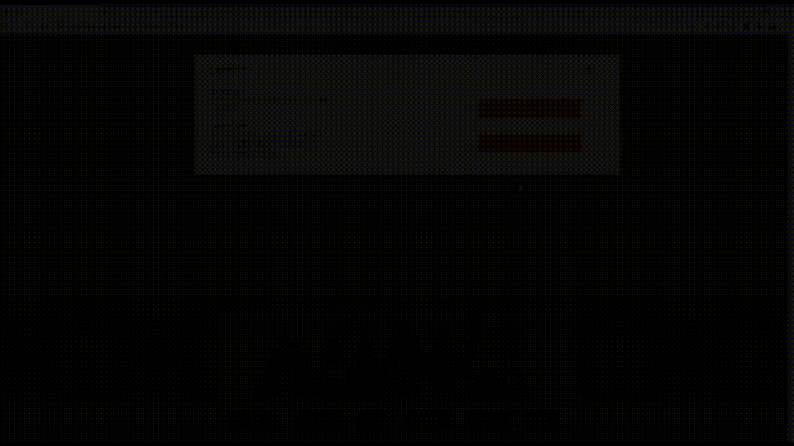

# danime-ListPlus

## Abstarct
dアニメストアの作品を自在に管理しましょう！ (Chrome Storeへはこれから申請)

## Introduction

素晴らしいアニメ動画配信サイトのdアニメストアでは、非常にたくさんの作品が配信されていますが、
それらを分類・管理する方法は実はほとんどありません。
具体的には以下の2つです。本拡張機能は「マイリスト」機能を大幅に強化し、手軽に気軽に作品を管理分類できるようにします。

| | 分類 |　保存作品数 | 備考 |
|-|-|-| - |
| 気になるリスト| なし | 500 作品 | 気になるリスト登録数は作品人気の指標になる。  スマホからの操作は簡単。 |
| マイリスト | 最大20件 | 50 作品 / 1 リスト | マイリスト名は10文字以内。  登録などの操作は煩雑。 ~~運営からも見放されている。~~ |
| キャッシュリスト | **無制限** | **無制限** | 基本的に制約はなし。スマホなどからは利用できないが、**マイリストと相互変換可能**。 |

- キャッシュリスト (拡張機能のキャッシュに保存される疑似マイリスト) は保存作品数・リスト数・名前文字数、すべて制限なく利用できます。
- マイリスト・キャッシュリスト・気になるリストへの作品の登録・削除の際に、**複数選択**することができます。
- 複数のリストを合成して、マイリスト・キャッシュリストを作成することができます。その際に重複は自動的に排除されます。
- `json / csv / tsv`形式での**インポート・エクスポートをサポート**します。
- 作品ボックスの背景色で各種リストへの登録状況を把握できます。
- 「続きから見る」などのページで、1ページに表示する作品数を変更できます。
- マイリスト・キャッシュリストの並び順を変更できます。キャッシュリスト内の作品も並び替えも可能です。

詳しい使い方はHackMDのDocuments(作成中)をご覧ください。

## Feature

- `json`ファイルからキャッシュリストをインポートしたり、複数のキャッシュリストを合成する。
- 1ページに表示する作品数を変更して、リストへの追加を円滑にする。

## Caution

本拡張機能はまだ動作が不安定です。
ご了承ください。

## License

MIT
